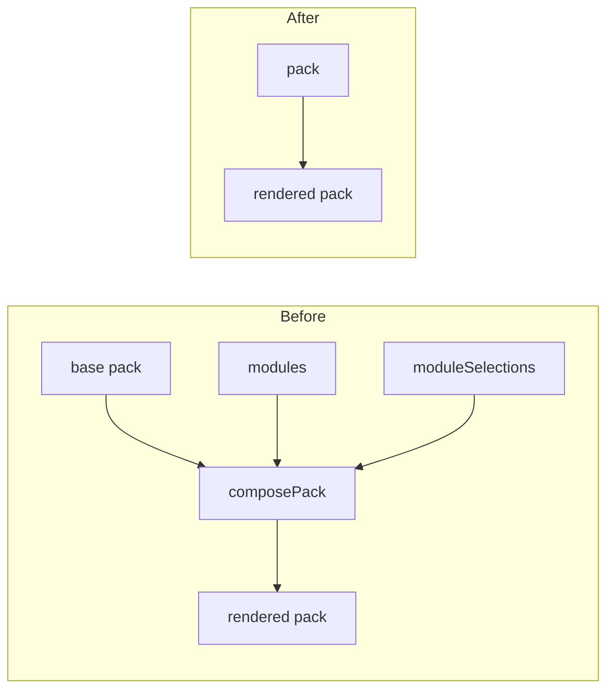
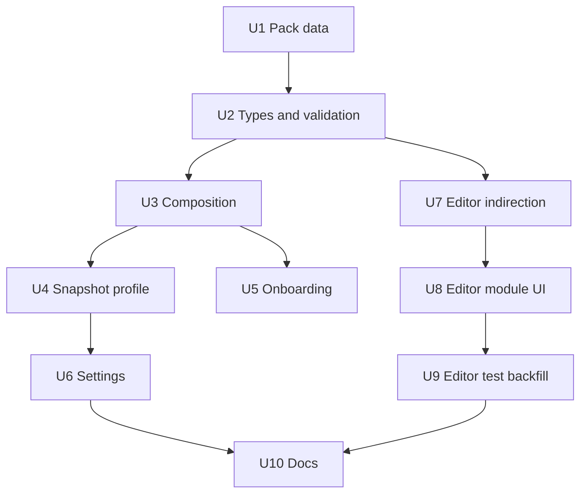

# Remove the Module System - Plan

## Goal Capsule

**Objective.** Delete the composable form-module system from LifeScribe Vault. The three fields modules contribute become permanent optional fields, and every surface built to present or author module choices is removed.

**Product authority.** The app is unreleased with a single testing user, so no vault, snapshot, or exported pack in existence needs to survive this change. That removes migration, back-compat, and tolerance from scope entirely.

**Open blockers.** None. Every product decision is settled, and this work branches from `main`, which now carries both the Settings shell and the module system.

**Execution profile.** Deletion-led. Most units remove code; the few that add anything add a field, a test, or a line of helper text. Delete pack data before the types that describe it, and delete leaves before the code that imports them, so the compiler names each next step.

**Stop conditions.** Stop and ask if removing the pack editor's indirection layer (U7) would require changing how sections or fields are edited, rather than changing who calls the existing edit helpers. Stop if any deletion would drop behavior that survives module removal — the Settings page, the vault-location feature, and the pack editor's section/field editing all stay.

**Tail ownership.** This plan owns the removal and the editor test backfill. It does not own the vault recovery, the attachment-sweep defect, or the Documents-section field rationalization.

**Product Contract preservation.** Product Contract unchanged. Planning added the Planning Contract, Implementation Units, Verification Contract, and Definition of Done below.

## Product Contract

### Summary

Remove the `modules` concept from the pack format, the app, and the pack editor. `passwordManagerMasterPassword`, `devicePin`, and `documentDigitalFile` become permanently present optional fields; the setup wizard, Settings, and the pack editor lose the surfaces that existed only to choose or author modules. The Recovery Kit stops emitting live credentials.

### Problem Frame

Modules were built to let one pack serve two postures: record where a password is kept, or hold the password itself. The machinery is large and the payload is small — the entire system contributes three fields and one field-removal.

The cost is concentrated in the pack editor. Because a field can originate from a module option rather than the base pack, the editor carries a provenance model: every section and field is tagged with the layer it came from, removed items are kept and struck through, an edit target selects which layer receives changes, and panels lock when the active target does not own what is selected. That model is the source of the editor's most persistent defects, and it exists for no reason other than modules.

The posture choice also lands at the worst moment. A user answers it during setup, before seeing a single form, and the answer silently determines which fields exist forever after. Changing it later rebuilds the pack and pushes orphaned values into archived answers.

A per-field decision is the shape that already works here: Backups & Storage carries a freeform location field beside an optional path field, and that pairing was kept deliberately.

### Key Decisions

**Remove the machinery, not just the feature** (session-settled: user-directed — chosen over surgical removal: leaving `ViewSource`, `EditTarget`, and the provenance layering behind would preserve a one-province provenance system that no longer varies). Everything whose only purpose was module support is deleted, including the editor's layering model and the wizard's step machine.

**No compatibility path for existing data** (session-settled: user-directed — chosen over flatten-on-read and read-and-ignore: the app is unreleased, the only user is testing, and no created vault matters). `moduleSelections` and `formMode` are deleted from the snapshot profile rather than preserved, and a pack carrying `modules` needs no tolerance.

**The Recovery Kit stops carrying credentials** (session-settled: user-directed — chosen over printing everything and printing nothing: the attached file's name is a pointer, which is what the Kit is for; a master password is not). `recoveryKit.ts` emits the raw value of any field its mapping lists, so exclusion has to happen in the pack's `kitMapping`, not in rendering code.

**Password fields read as ordinary optional fields** (session-settled: user-directed — chosen over copy that steers toward leaving them blank: uniform forms, and no nagging users who have already decided). The "locations only" posture stops being something the product asserts.

### How the rendered pack is produced

Removing modules removes a composition stage, which is why so much supporting code dies with it.

### Requirements

**Pack format and data**

R1. The `modules` key and its supporting types are removed from the form-pack model.
R2. `passwordManagerMasterPassword` is a permanent optional field of the Password Manager section.
R3. `devicePin` is a permanent optional field of the Device Inventory section.
R4. `documentDigitalFile` is a permanent optional field of the Documents section.
R5. `documentDigitalLocation` remains present, so a Documents record can carry both a digital location and an attached copy.
R6. Each of the three fields carries neutral helper text marking it optional, with no guidance for or against filling it in.
R7. Pack validation no longer accepts or validates modules.

**Composition**

R8. Pack composition is removed; the pack a vault renders from is the pack as authored.

**Onboarding**

R9. Setup presents no module questions.
R10. Setup collapses to a single screen covering the vault folder, owner name, and master password.

**Pack editor**

R11. The pack editor cannot author, edit, or delete modules.
R12. The pack editor renders one pack with no notion of layers, edit targets, or provenance.
R13. The Preview tab renders the pack directly, with no module selectors.

**Settings**

R14. Settings presents no form-option choices. The Vault location section remains.

**Snapshot**

R15. The vault profile carries neither `moduleSelections` nor `formMode`.

**Recovery Kit**

R16. The Recovery Kit lists an attached document by file name.
R17. The Recovery Kit cannot emit `passwordManagerMasterPassword` or `devicePin`.

**Documentation**

R18. The user guide describes no setup-time posture choice and no Settings form options.
R19. The user guide's Recovery Kit description matches what the Kit emits.
R20. `CLAUDE.md` no longer describes modules as an architectural law.

### Key Flows

F1. **First run.** **Trigger:** a user opens the app with no vault. They choose a vault folder, enter their name and master password, and reach the dashboard. No posture question is asked, and every field exists from the first save.

F2. **Recording a password manager.** **Trigger:** a user opens the Password Manager section. Provider, vault location, and emergency-access fields appear alongside an optional "Master password" field. Leaving it blank records only where the password is kept; filling it stores the password in the encrypted vault. Neither path is presented as preferred.

F3. **Attaching a document.** **Trigger:** a user opens a Documents record. Both "Digital location" and "Attached copy" are available. They may use either, both, or neither.

### Acceptance Examples

AE1. **Covers R2, R3, R4, R9.** A vault created after this change shows "Master password" in Password Manager, "PIN or passcode" in Device Inventory, and "Attached copy" in Documents, without the user having answered any question during setup.

AE2. **Covers R16, R17.** A user stores a master password, a device PIN, and attaches `will-2024.pdf`, then generates the Recovery Kit. The Kit names `will-2024.pdf`. Neither the master password nor the PIN appears anywhere in it.

AE3. **Covers R5.** A Documents record with both a digital location and an attached copy retains both after saving and reloading.

AE4. **Covers R7.** A pack containing a `modules` array does not load as a valid pack.

AE5. **Covers R12.** Selecting any section in the pack editor opens its property panel directly. No section or field is struck through, labelled with an origin, or locked behind an active-target selection.

### Success Criteria

S1. No `module` identifier remains in `apps/desktop/src`, `apps/desktop/pack-editor`, or `apps/desktop/src-tauri/resources/packs/default-pack.json`.
S2. The Rust and frontend suites pass, with typecheck and lint clean.
S3. Every test whose subject was module behavior is deleted or rewritten against the new shape; none is left skipped or asserting removed behavior.

### Scope Boundaries

Out of scope:

- Recovering the vault currently at `old_vault.sqlite3`.
- The attachment-sweep defect, where unlocking one vault deletes another vault's attachments from a shared folder.
- Rationalizing how many ways a Documents record can reference the same document. After R5, a record carries a physical location, a digital location, and an attached copy. Reducing that is a pack-content decision, changeable in the pack editor without code.
- Any change to vault location, backup, or restore behavior.

### Dependencies / Assumptions

D1. `main` carries the Settings page, the Settings route, and the vault-location feature. The Settings shell arrived with the module work but survives module removal, and `VaultLocation` renders inside it — so `SettingsPage` and its route must keep working throughout this change.
D2. Removing `VaultOptions` leaves `SettingsPage` with one section. Its `selections` and `onApply` props, its `loadDefaultPack` call, and its `base` state exist only to serve `VaultOptions` and become dead with it.

### Outstanding Questions

**Deferred to Planning**

Q1. Where the single setup screen puts the vault-folder control relative to the name and password fields (R10).
Q2. The exact helper-text wording for the three fields (R6). Intent is settled; phrasing is not.

### Sources / Research

- `apps/desktop/src/domain/formModel.ts` — `FormModule`, `FormModuleOption`, `ModuleAddField`, `ModuleAddSection`, and `FormPack.modules`.
- `apps/desktop/src-tauri/resources/packs/default-pack.json` — the `secrets` and `file-method` modules: three added fields, one `removeKeys` for `documentDigitalLocation`, and `kitAdditions` routing the added fields into the Kit.
- `apps/desktop/src/domain/packValidation.ts` — `validateModules`, which recomposes and revalidates the pack per module option.
- `apps/desktop/src/creator/editorView.ts` and `apps/desktop/src/creator/editorEdits.ts` — the provenance model (`ViewSource`, `EditTarget`) and eleven module-only functions.
- `apps/desktop/src/domain/recoveryKit.ts` — emits the raw value of any mapped field with no redaction by type, name, or `protected` flag; its "no secret-value slots" property is structural and depends entirely on `kitMapping` contents.
- `apps/desktop/src/domain/snapshot.ts` — `moduleSelections`, `formMode`, and the conversions between them.
- No `readinessRule.requiredKeys` in the shipped pack references a module-added field, so section readiness is unaffected by making these fields permanent.
- Files deleted outright total roughly 1,050 lines, the largest being `apps/desktop/src/creator/editorEdits.test.ts` (448) and `apps/desktop/src/domain/composePack.test.ts` (387).

---

## Planning Contract

### Key Technical Decisions

KTD1. **Delete the pack editor's indirection layer rather than collapsing it** (session-settled: user-directed — chosen over collapsing each `*InTarget` function to its base-only body: a router with one route is dead abstraction that still has to be read and maintained). `apps/desktop/src/creator/editorView.ts` and `apps/desktop/src/creator/editorEdits.ts` are deleted. The pack editor's components call the existing helpers in `apps/desktop/src/creator/packEdits.ts` and `apps/desktop/src/forms/structure/fieldOps.ts` directly.

KTD2. **Backfill tests for the simplified editor** (session-settled: user-directed — chosen over deleting only the module-specific tests: the layering being removed is where this project's defects have concentrated, so the coverage is replaced rather than dropped). U9 restores editor coverage against the post-removal shape.

KTD3. **Enforce the Recovery Kit exclusion in pack data, not in rendering code** (inherits Product Contract Key Decision "The Recovery Kit stops carrying credentials"). `apps/desktop/src/domain/recoveryKit.ts` emits the raw value of any field its mapping lists and has no redaction by type, name, or `protected` flag. The only way to keep a credential out of the Kit is to keep its `systemKey` out of `kitMapping`. `recoveryKit.ts` is not modified.

KTD4. **Delete pack data before the types that describe it.** The shipped pack's `modules` array is removed in U1, before `FormPack.modules` disappears in U2. The reverse order leaves a pack whose shape no type describes, and `loadDefaultPack` casts rather than validating structurally, so the mismatch would surface at runtime instead of at compile time.

KTD5. **Gate on the pack editor's own typecheck and lint.** `apps/desktop/pack-editor/` is a separate dev app with `typecheck:pack-editor` and `lint:pack-editor` scripts that the main `typecheck` and `lint` do not cover. The pack editor is this plan's largest touchpoint, so all four gates run.

KTD6. **Rewrite the setup-wizard tests rather than deleting them.** `apps/desktop/src/routes/SetupScreen.test.tsx` covers folder selection and identity validation alongside module-step walking. Deleting the file to remove the module tests would take working coverage with it.

### High-Level Technical Design

Unit dependencies. The chain runs data → types → consumers, so each deletion is compile-checked by the one before it.

### Assumptions

A1. `apps/desktop/src/domain/packMigrations.ts` references `FormPack` types only and does not branch on `modules`. Verify in U2 before assuming no change is needed.

A2. Rust does not reference modules. The snapshot is opaque `serde_json::Value` to Rust, so `moduleSelections` and `formMode` cross the IPC boundary without Rust naming them. Confirm with a search in U4; if a reference exists, it belongs to U4.

A3. The base-target behavior currently tested in `editorEdits.test.ts` is already covered by `packEdits.test.ts` and `fieldOps.test.ts`. U7 verifies this before deleting; any behavior found only in `editorEdits.test.ts` moves to the owning helper's test file rather than being lost.

---

## Implementation Units

### Unit Index

| U-ID | Title | Key files | Depends on |
|---|---|---|---|
| U1 | Pack data: three fields become permanent | `default-pack.json` | — |
| U2 | Remove module types and validation | `formModel.ts`, `packValidation.ts` | U1 |
| U3 | Remove pack composition | `composePack.ts`, `useComposedPreview.ts`, `Dashboard.tsx` | U2 |
| U4 | Remove module selections from the snapshot | `snapshot.ts`, `App.tsx`, `Dashboard.tsx` | U3 |
| U5 | Collapse onboarding to one screen | `SetupScreen.tsx`, `ModuleQuestion.tsx`, `App.tsx` | U3 |
| U6 | Remove the Settings form options | `VaultOptions.tsx`, `SettingsPage.tsx`, `Dashboard.tsx` | U4 |
| U7 | Delete the editor indirection layer | `editorView.ts`, `editorEdits.ts` | U2 |
| U8 | Remove the editor's module UI | `PackEditorApp.tsx`, `OverlayDesign.tsx`, `SectionNav.tsx` | U7 |
| U9 | Backfill editor tests | `pack-editor/*.test.tsx` | U8 |
| U10 | Update the docs | `user-guide.md`, `CLAUDE.md` | U6, U9 |

### U1. Pack data: three fields become permanent

**Goal.** The shipped pack carries the three formerly-module fields as ordinary optional fields and no `modules` array.

**Requirements.** R1, R2, R3, R4, R5, R6, R16, R17.

**Dependencies.** None.

**Files.**
- Modify: `apps/desktop/src-tauri/resources/packs/default-pack.json`
- Modify: `apps/desktop/src/domain/defaultPack.test.ts`
- Modify: `apps/desktop/src/domain/loadDefaultPack.test.ts`
- Delete: `apps/desktop/src/domain/basePackModules.test.ts`
- Create: a shipped-pack assertion for the three fields, either in `defaultPack.test.ts` or replacing the deleted file

**Approach.** Move `passwordManagerMasterPassword` into the `password-manager` section's `plan` group, `devicePin` into the `devices` section's `device` group, and `documentDigitalFile` into the `documents` section's `document` group, each `required: false` and `protected: false`. Keep `documentDigitalLocation` — the `attach` option's `removeKeys` entry disappears with the module rather than being honored. Give each of the three neutral helper text marking it optional, with no steer for or against filling it in. Add `documentDigitalFile` to the Documents section's `kitMapping`; do **not** add `passwordManagerMasterPassword` or `devicePin` to any `kitMapping` (KTD3). Delete the `modules` array.

`apps/desktop/src/domain/loadDefaultPack.test.ts` asserts `pack.modules` is defined in two cases. Drop those assertions; keep the `packId` and resource-read ones.

**Patterns to follow.** The existing Backups & Storage section already pairs a freeform location field with an optional path field — the same coexistence this unit creates in Documents.

**Test scenarios.**
- Covers R2, R3, R4. The shipped pack contains all three fields in the named sections, each optional.
- Covers R5. The Documents section contains both `documentDigitalLocation` and `documentDigitalFile`.
- Covers R7. The shipped pack has no `modules` key.
- Covers R16. The Documents `kitMapping` lists `documentDigitalFile`.
- Covers R17. No section's `kitMapping` lists `passwordManagerMasterPassword` or `devicePin`.
- The pack still passes `validatePack`.
- Section readiness is unchanged: no `readinessRule.requiredKeys` gains or loses an entry.

**Verification.** `npm --prefix apps/desktop run test` passes, and the shipped pack validates.

### U2. Remove module types and validation

**Goal.** The form-pack model and its validator no longer know what a module is.

**Requirements.** R1, R7.

**Dependencies.** U1.

**Files.**
- Modify: `apps/desktop/src/domain/formModel.ts`
- Modify: `apps/desktop/src/domain/packValidation.ts`
- Modify: `apps/desktop/src/domain/packValidation.test.ts`

**Approach.** Delete `ModuleAddField`, `ModuleAddSection`, `FormModuleOption`, `FormModule`, and `FormPack.modules` from `formModel.ts`. Delete `validateModules` and its call site from `packValidation.ts`, along with its `composePack` import. Remove the module-specific tests from `packValidation.test.ts` — duplicate module ids, cross-module systemKey collisions, `defaultOptionId` validity, compose-failure surfacing — and keep the structural, section, readiness, and kitMapping tests. Confirm A1: check whether `packMigrations.ts` branches on `modules` before concluding it needs no change.

**Test scenarios.**
- Covers R7. A pack object carrying a `modules` array does not typecheck, and `validatePack` no longer runs module validation.
- The surviving `validatePack` checks still reject a pack with a duplicate `systemKey`, a missing `readinessRule`, and a `kitMapping` naming an unknown field.

**Verification.** `npm --prefix apps/desktop run typecheck` is clean and the pack validation suite passes.

### U3. Remove pack composition

**Goal.** The pack a vault renders from is the pack as authored, with no composition step.

**Requirements.** R8.

**Dependencies.** U2.

**Files.**
- Delete: `apps/desktop/src/domain/composePack.ts`, `apps/desktop/src/domain/composePack.test.ts`
- Delete: `apps/desktop/src/domain/useComposedPreview.ts`, `apps/desktop/src/domain/useComposedPreview.test.ts`
- Modify: `apps/desktop/src/routes/Dashboard.tsx`

**Approach.** `resolveBasePack` collapses to returning `parsed.customPack ?? (await loadDefaultPack())`. Delete both composition files and their tests. The remaining consumers — `useComposedPreview` in `SetupScreen.tsx` and `VaultOptions.tsx`, and `composePack` directly in `pack-editor/PackEditorApp.tsx`'s Preview tab — are handled in U5, U6, and U8. If the compiler objects here, the import removal belongs to those units, not this one.

**Test scenarios.**
- A vault with a `customPack` renders from that pack.
- A vault without one renders from the bundled pack.
- Covers R8. No code path transforms the pack between load and render.

**Verification.** `npm --prefix apps/desktop run test` passes for the Dashboard load path.

### U4. Remove module selections from the snapshot

**Goal.** The vault profile carries neither `moduleSelections` nor `formMode`.

**Requirements.** R15.

**Dependencies.** U3.

**Files.**
- Modify: `apps/desktop/src/domain/snapshot.ts`
- Modify: `apps/desktop/src/domain/snapshot.test.ts`
- Modify: `apps/desktop/src/domain/loadDefaultPack.ts`, `apps/desktop/src/domain/loadDefaultPack.test.ts`
- Modify: `apps/desktop/src/App.tsx`
- Modify: `apps/desktop/src/routes/Dashboard.tsx`
- Modify: `apps/desktop/src/App.test.tsx`

**Approach.** Delete `FormMode`, the `formMode` and `moduleSelections` fields on `VaultProfile`, `moduleSelectionsFromFormMode`, `formModeFromModuleSelections`, `toModuleSelections`, `asModuleSelections`, `asFormMode`, and the `SeedOrMode` union. Keep `ownerName`, `reviewCadenceMonths`, `basePackId`, and every non-profile part of the snapshot pipeline. `loadDefaultPack.ts` imports `FormMode` and takes a vestigial `mode` parameter that no production caller passes; drop both, leaving `loadDefaultPack(): Promise<FormPack>`, and update the `loadDefaultPack("credential")` case in its test. Remove `moduleSelectionsHint` and `DEFAULT_MODULE_SELECTIONS_HINT` from `Dashboard.tsx` and the state threading it from `App.tsx`. Drop the `formMode` assertion from `App.test.tsx` while keeping the surrounding vault-creation test. Confirm A2 with a search for `moduleSelections` and `formMode` under `apps/desktop/src-tauri/`.

**Test scenarios.**
- `normalizeSnapshot` still fills defaults for `ownerName` and `reviewCadenceMonths`.
- `buildSnapshot` still round-trips unknown top-level fields through `extra`.
- Covers R15. A snapshot written after this change contains no `formMode` or `moduleSelections` in its profile.
- Values, `sectionMeta`, `overlay`, `kitMeta`, and `customPack` round-trip unchanged.

**Verification.** `npm --prefix apps/desktop run test` and `typecheck` pass.

### U5. Collapse onboarding to one screen

**Goal.** Setup is a single screen covering the vault folder, owner name, and master password.

**Requirements.** R9, R10.

**Dependencies.** U3.

**Files.**
- Modify: `apps/desktop/src/routes/SetupScreen.tsx`
- Modify: `apps/desktop/src/routes/SetupScreen.test.tsx`
- Modify: `apps/desktop/src/App.tsx`
- Modify: `apps/desktop/src/App.css`
- Delete: `apps/desktop/src/forms/ModuleQuestion.tsx`, `apps/desktop/src/forms/ModuleQuestion.test.tsx`

**Approach.** Remove the step machine — `step`, `selections`, `modules`, `currentModule`, `lastStep`, `goNext`, `goBack`, `onFinalStep`, the progress dots, and the `composeError` gate. The folder controls and the identity controls render together on one screen whose primary action is Create vault. `onCreate` drops its `moduleSelections` parameter, and `App.handleCreate` drops it in turn. Delete only the module-question rules from `App.css`; the `.vault-form`, `.password-field`, and setup-location rules are still used.

Per KTD6, rewrite `SetupScreen.test.tsx` against the single screen rather than deleting it. The folder-selection tests and the identity-validation tests describe behavior that survives; the module-step-walking and back-navigation tests do not.

Q1 is open here: where the folder control sits relative to name and password. Either arrangement satisfies R10.

**Test scenarios.**
- Covers R9. Setup shows no module question.
- Covers R10. Folder, name, and password all appear on one screen with no Next button.
- The default vault folder is shown, and choosing a different folder updates it.
- Choosing a folder that already holds a vault hands off to unlock without asking for a password.
- A password under 15 characters blocks creation with the existing message.
- Mismatched passwords block creation.
- Creation is blocked until the no-recovery acknowledgment is checked.
- `onCreate` receives the master password and owner name, and nothing else.

**Verification.** `npm --prefix apps/desktop run test -- SetupScreen` passes, and a created vault reaches the dashboard.

### U6. Remove the Settings form options

**Goal.** Settings presents no form-option choices, and the Vault location section is untouched.

**Requirements.** R14.

**Dependencies.** U4.

**Files.**
- Delete: `apps/desktop/src/routes/settings/VaultOptions.tsx`, `apps/desktop/src/routes/settings/VaultOptions.test.tsx`
- Modify: `apps/desktop/src/routes/SettingsPage.tsx`, `apps/desktop/src/routes/SettingsPage.test.tsx`
- Modify: `apps/desktop/src/routes/Dashboard.tsx`, `apps/desktop/src/routes/Dashboard.test.tsx`

**Approach.** Delete `VaultOptions` and its test. `SettingsPage` loses the `selections` and `onApply` props, the `loadDefaultPack` effect, and the `base` state — all of which existed only to feed `VaultOptions` (D2). It keeps its shell and renders `VaultLocation`. Delete `applyModuleSelections` from `Dashboard.tsx` and the two props from its `SettingsPage` render site. Remove the `Dashboard module selections — credential pack on load` describe block; the readiness, save, draft, and lock tests around it stay. Rewrite `SettingsPage.test.tsx` to cover the Vault location section rather than waiting on `VaultOptions` to appear.

**Test scenarios.**
- Covers R14. Settings renders the Vault location section and no form options.
- The sidebar still routes to Settings, and a section still routes back to the dashboard.
- Moving the vault from Settings still locks, moves, and lands on the locked screen with its notice.

**Verification.** `npm --prefix apps/desktop run test` passes, and the vault-location feature is unaffected.

### U7. Delete the editor indirection layer

**Goal.** The pack editor edits one pack through the existing edit helpers, with no target routing and no provenance view.

**Requirements.** R12.

**Dependencies.** U2.

**Files.**
- Delete: `apps/desktop/src/creator/editorView.ts`, `apps/desktop/src/creator/editorView.test.ts`
- Delete: `apps/desktop/src/creator/editorEdits.ts`, `apps/desktop/src/creator/editorEdits.test.ts`
- Modify: `apps/desktop/src/creator/packEdits.test.ts` or `apps/desktop/src/forms/structure/fieldOps.test.ts` if A3 finds uncovered behavior

**Approach.** Per KTD1, delete both files outright. Before deleting `editorEdits.test.ts`, verify A3: read its base-target tests and confirm each behavior is already covered by `packEdits.test.ts` or `fieldOps.test.ts`. Move anything covered only there into the owning helper's test file. The editor components that called `*InTarget` functions now call `packEdits.ts` and `fieldOps.ts` directly — that rewiring is U8.

This unit and U8 are separable but land together; U7 removes the layer, U8 removes its callers. Expect the compiler to be red between them.

**Execution note.** Confirm A3 before deleting, not after. Deleting the test file first loses the evidence needed to decide what to move.

**Test scenarios.**
- Every behavior previously proven by `editorEdits.test.ts` base-target cases is still proven by some test.
- Adding, updating, removing, and reordering a field still work through the helper functions.
- Adding, renaming, and removing a section still work through the helper functions.

**Verification.** `npm --prefix apps/desktop run test` shows no net loss of covered behavior for section and field editing.

### U8. Remove the editor's module UI

**Goal.** The pack editor renders one pack with no layers, targets, or module authoring.

**Requirements.** R11, R12, R13.

**Dependencies.** U7.

**Files.**
- Modify: `apps/desktop/pack-editor/PackEditorApp.tsx`
- Modify: `apps/desktop/pack-editor/OverlayDesign.tsx`, `apps/desktop/pack-editor/SectionNav.tsx`
- Delete: `apps/desktop/pack-editor/ModulePropertyPanel.tsx`
- Modify: `apps/desktop/pack-editor/PackEditorApp.test.tsx`
- Modify: `apps/desktop/pack-editor/pack-editor.css`

**Approach.** From `PackEditorApp.tsx`, remove the module rail, the `viewSelections`, `previewSelections`, `activeTarget`, and `editingModuleId` state, the `buildEditorView` call, the Preview tab's module selectors, and the `ModulePropertyPanel` render. The Design tab renders the pack's sections directly; the Preview tab renders the pack's resolved section directly, with no composition and no preview error.

`OverlayDesign.tsx` and `SectionNav.tsx` both carry the provenance model — `ownerLabel`, `layerOf`, `isActiveOwner`, the `data-layer` attributes, the struck-through removed rows, the "comes from X, switch the active target" locked panels, and the `LockedSectionRemoveButton`. All of it goes; each renders plain sections and fields. Remove the now-unused provenance rules from `pack-editor.css`.

**Test scenarios.**
- Covers R11. The editor offers no way to create, edit, or delete a module.
- Covers R13. The Preview tab renders without module selectors.
- Covers R12. Selecting a section opens its property panel directly, with nothing struck through, origin-labelled, or locked.
- Renaming a section persists to the saved pack.
- Adding and removing a field persists to the saved pack.
- Reordering fields by drag persists.
- Removing a section still requires its two-step confirmation.

**Verification.** `npm --prefix apps/desktop run typecheck:pack-editor` and `lint:pack-editor` are clean, and the pack editor loads, edits, and saves.

### U9. Backfill editor tests

**Goal.** The simplified editor has coverage proportional to the behavior it retains.

**Requirements.** R11, R12, R13.

**Dependencies.** U8.

**Files.**
- Modify: `apps/desktop/pack-editor/PackEditorApp.test.tsx`
- Create: colocated tests for `OverlayDesign` and `SectionNav` if their behavior is not reachable through `PackEditorApp.test.tsx`

**Approach.** Per KTD2, replace the deleted module coverage rather than dropping it. The editor's defects have historically come from the layering being removed, so the backfill targets what remains: section navigation and selection, field property editing, add and remove flows with their confirmations, drag reorder, and the save path. Prefer testing through `PackEditorApp` where a behavior is reachable that way; add a colocated component test only where it is not.

**Test scenarios.**
- Selecting each section in the nav opens its property panel.
- Editing a section title updates the saved pack.
- Adding a field of each supported type appends it to the right group.
- Removing a non-protected field updates the saved pack; a protected field offers no Remove.
- Removing a section requires confirmation and can be cancelled.
- Dragging a field to a new position persists the new order.
- The JSON tab reflects edits made in the Design tab.
- Save writes the edited pack and reloads it.

**Verification.** `npm --prefix apps/desktop run test` passes, and pack-editor coverage is no lower than before the removal.

### U10. Update the docs

**Goal.** The user guide and `CLAUDE.md` describe the app as it now behaves.

**Requirements.** R18, R19, R20.

**Dependencies.** U6, U9.

**Files.**
- Modify: `docs/user-guide.md`
- Modify: `CLAUDE.md`

**Approach.** In `docs/user-guide.md`, remove the setup-choice table and the "Changing what the vault stores" section, and rewrite the Recovery Kit description to match what the Kit emits — it lists attached file names and never password values. Check the Getting Started section, which describes setup as asking for a posture choice. In `CLAUDE.md`, remove modules from the Architecture Laws; the composable-modules law and any reference to `composePack` no longer describe the system.

**Test scenarios.** Test expectation: none — documentation only.

**Verification.** No section of `docs/user-guide.md` describes a choice the app no longer offers, and `CLAUDE.md`'s Architecture Laws all hold against the code.

---

## Verification Contract

| Gate | Command | Applies to |
|---|---|---|
| Frontend tests | `npm --prefix apps/desktop run test` | U1-U10 |
| Frontend typecheck | `npm --prefix apps/desktop run typecheck` | U1-U6, U10 |
| Frontend lint | `npm --prefix apps/desktop run lint` | U1-U6, U10 |
| Pack editor typecheck | `npm --prefix apps/desktop run typecheck:pack-editor` | U7-U9 |
| Pack editor lint | `npm --prefix apps/desktop run lint:pack-editor` | U7-U9 |
| Rust tests | `cargo test --manifest-path apps/desktop/src-tauri/Cargo.toml` | U4 |

All six gates pass before the work is done, not only the units that motivated them (KTD5).

Two checks the automated gates cannot make, because the suite mocks `vaultApi` and never renders the pack editor against a real pack file:

- Create a vault through the collapsed setup screen and confirm all three fields appear in their sections.
- Open the pack editor, edit a section and a field, save, and reload.

---

## Definition of Done

Global:

- No `module` identifier remains in `apps/desktop/src`, `apps/desktop/pack-editor`, or `apps/desktop/src-tauri/resources/packs/default-pack.json` (S1).
- All six verification gates pass (S2).
- Every test whose subject was module behavior is deleted or rewritten against the new shape — none is left skipped or asserting removed behavior (S3).
- No file deleted by this plan is still imported anywhere.
- Abandoned experimental code from any approach that did not pan out is removed rather than left in the diff.

Per unit:

- U1: the shipped pack validates, carries the three fields, and lists neither the master password nor the device PIN in any `kitMapping`.
- U2: `FormPack` has no `modules`, and `validateModules` is gone.
- U3: no composition step runs between pack load and render.
- U4: a written snapshot's profile has no `formMode` and no `moduleSelections`.
- U5: setup is one screen and `onCreate` takes two arguments.
- U6: Settings renders Vault location only, and moving the vault still works.
- U7: `editorView.ts` and `editorEdits.ts` are gone with no behavior left unproven.
- U8: the pack editor has no rail, no targets, and no provenance styling.
- U9: pack-editor coverage is no lower than before the removal.
- U10: no doc describes a choice the app no longer offers.
