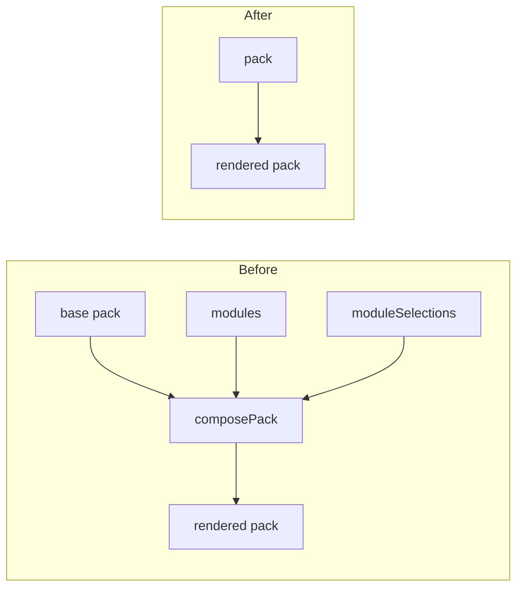

# Remove the Module System - Plan

## Goal Capsule

**Objective.** Delete the composable form-module system from LifeScribe Vault. The three fields modules contribute become permanent optional fields, and every surface built to present or author module choices is removed.

**Product authority.** The app is unreleased with a single testing user, so no vault, snapshot, or exported pack in existence needs to survive this change. That removes migration, back-compat, and tolerance from scope entirely.

**Open blockers.** Every product decision is settled. One process question remains: whether PR #12, which introduced module-driven onboarding, is closed unmerged or merged and then reverted. That answer shapes branch strategy, not product behavior.

## Product Contract

### Summary

Remove the `modules` concept from the pack format, the app, and the pack editor. `passwordManagerMasterPassword`, `devicePin`, and `documentDigitalFile` become permanently present optional fields; the setup wizard, Settings, and the pack editor lose the surfaces that existed only to choose or author modules. The Recovery Kit stops emitting live credentials.

### Problem Frame

Modules were built to let one pack serve two postures: record where a password is kept, or hold the password itself. The machinery is large and the payload is small — the entire system contributes three fields and one field-removal.

The cost is concentrated in the pack editor. Because a field can originate from a module option rather than the base pack, the editor carries a provenance model: every section and field is tagged with the layer it came from, removed items are kept and struck through, an edit target selects which layer receives changes, and panels lock when the active target does not own what is selected. That model is the source of the editor's most persistent defects, and it exists for no reason other than modules.

The posture choice also lands at the worst moment. A user answers it during setup, before seeing a single form, and the answer silently determines which fields exist forever after. Changing it later rebuilds the pack and pushes orphaned values into archived answers.

A per-field decision is the shape that already works here: Backups & Storage carries a freeform location field beside an optional path field, and that pairing was kept deliberately.

### Key Decisions

**Remove the machinery, not just the feature** (session-settled: user-directed — chosen over surgical removal: leaving `ViewSource`, `EditTarget`, and the provenance layering behind would preserve a one-province provenance system that no longer varies). Everything whose only purpose was module support is deleted, including the editor's layering model and the wizard's step machine.

**No compatibility path for existing data** (session-settled: user-directed — chosen over flatten-on-read and read-and-ignore: the app is unreleased, the only user is testing, and no created vault matters). `moduleSelections` and `formMode` are deleted from the snapshot profile rather than preserved, and a pack carrying `modules` needs no tolerance.

**The Recovery Kit stops carrying credentials** (session-settled: user-directed — chosen over printing everything and printing nothing: the attached file's name is a pointer, which is what the Kit is for; a master password is not). `recoveryKit.ts` emits the raw value of any field its mapping lists, so exclusion has to happen in the pack's `kitMapping`, not in rendering code.

**Password fields read as ordinary optional fields** (session-settled: user-directed — chosen over copy that steers toward leaving them blank: uniform forms, and no nagging users who have already decided). The "locations only" posture stops being something the product asserts.

### How the rendered pack is produced

Removing modules removes a composition stage, which is why so much supporting code dies with it.

### Requirements

**Pack format and data**

R1. The `modules` key and its supporting types are removed from the form-pack model.
R2. `passwordManagerMasterPassword` is a permanent optional field of the Password Manager section.
R3. `devicePin` is a permanent optional field of the Device Inventory section.
R4. `documentDigitalFile` is a permanent optional field of the Documents section.
R5. `documentDigitalLocation` remains present, so a Documents record can carry both a digital location and an attached copy.
R6. Each of the three fields carries neutral helper text marking it optional, with no guidance for or against filling it in.
R7. Pack validation no longer accepts or validates modules.

**Composition**

R8. Pack composition is removed; the pack a vault renders from is the pack as authored.

**Onboarding**

R9. Setup presents no module questions.
R10. Setup collapses to a single screen covering the vault folder, owner name, and master password.

**Pack editor**

R11. The pack editor cannot author, edit, or delete modules.
R12. The pack editor renders one pack with no notion of layers, edit targets, or provenance.
R13. The Preview tab renders the pack directly, with no module selectors.

**Settings**

R14. Settings presents no form-option choices. The Vault location section remains.

**Snapshot**

R15. The vault profile carries neither `moduleSelections` nor `formMode`.

**Recovery Kit**

R16. The Recovery Kit lists an attached document by file name.
R17. The Recovery Kit cannot emit `passwordManagerMasterPassword` or `devicePin`.

**Documentation**

R18. The user guide describes no setup-time posture choice and no Settings form options.
R19. The user guide's Recovery Kit description matches what the Kit emits.
R20. `CLAUDE.md` no longer describes modules as an architectural law.

### Key Flows

F1. **First run.** **Trigger:** a user opens the app with no vault. They choose a vault folder, enter their name and master password, and reach the dashboard. No posture question is asked, and every field exists from the first save.

F2. **Recording a password manager.** **Trigger:** a user opens the Password Manager section. Provider, vault location, and emergency-access fields appear alongside an optional "Master password" field. Leaving it blank records only where the password is kept; filling it stores the password in the encrypted vault. Neither path is presented as preferred.

F3. **Attaching a document.** **Trigger:** a user opens a Documents record. Both "Digital location" and "Attached copy" are available. They may use either, both, or neither.

### Acceptance Examples

AE1. **Covers R2, R3, R4, R9.** A vault created after this change shows "Master password" in Password Manager, "PIN or passcode" in Device Inventory, and "Attached copy" in Documents, without the user having answered any question during setup.

AE2. **Covers R16, R17.** A user stores a master password, a device PIN, and attaches `will-2024.pdf`, then generates the Recovery Kit. The Kit names `will-2024.pdf`. Neither the master password nor the PIN appears anywhere in it.

AE3. **Covers R5.** A Documents record with both a digital location and an attached copy retains both after saving and reloading.

AE4. **Covers R7.** A pack containing a `modules` array does not load as a valid pack.

AE5. **Covers R12.** Selecting any section in the pack editor opens its property panel directly. No section or field is struck through, labelled with an origin, or locked behind an active-target selection.

### Success Criteria

S1. No `module` identifier remains in `apps/desktop/src`, `apps/desktop/pack-editor`, or `apps/desktop/src-tauri/resources/packs/default-pack.json`.
S2. The Rust and frontend suites pass, with typecheck and lint clean.
S3. Every test whose subject was module behavior is deleted rather than adapted.

### Scope Boundaries

Out of scope:

- Recovering the vault currently at `old_vault.sqlite3`.
- The attachment-sweep defect, where unlocking one vault deletes another vault's attachments from a shared folder.
- Rationalizing how many ways a Documents record can reference the same document. After R5, a record carries a physical location, a digital location, and an attached copy. Reducing that is a pack-content decision, changeable in the pack editor without code.
- Any change to vault location, backup, or restore behavior.

### Dependencies / Assumptions

D1. The vault-location work on `feat/vault-data-location` is independent of modules and is unaffected by this change. It branched from `feat/module-driven-onboarding`, so the module commits sit in its ancestry.

### Outstanding Questions

**Resolve Before Planning**

Q1. Whether PR #12 is closed unmerged or merged and then reverted, and whether `feat/vault-data-location` is rebased onto `main` as a result. This decides the branch this work starts from.

**Deferred to Planning**

Q2. Where the single setup screen puts the vault-folder control relative to the name and password fields (R10).
Q3. The exact helper-text wording for the three fields (R6). Intent is settled; phrasing is not.

### Sources / Research

- `apps/desktop/src/domain/formModel.ts` — `FormModule`, `FormModuleOption`, `ModuleAddField`, `ModuleAddSection`, and `FormPack.modules`.
- `apps/desktop/src-tauri/resources/packs/default-pack.json` — the `secrets` and `file-method` modules: three added fields, one `removeKeys` for `documentDigitalLocation`, and `kitAdditions` routing the added fields into the Kit.
- `apps/desktop/src/domain/packValidation.ts` — `validateModules`, which recomposes and revalidates the pack per module option.
- `apps/desktop/src/creator/editorView.ts` and `apps/desktop/src/creator/editorEdits.ts` — the provenance model (`ViewSource`, `EditTarget`) and eleven module-only functions.
- `apps/desktop/src/domain/recoveryKit.ts` — emits the raw value of any mapped field with no redaction by type, name, or `protected` flag; its "no secret-value slots" property is structural and depends entirely on `kitMapping` contents.
- `apps/desktop/src/domain/snapshot.ts` — `moduleSelections`, `formMode`, and the conversions between them.
- No `readinessRule.requiredKeys` in the shipped pack references a module-added field, so section readiness is unaffected by making these fields permanent.
- Files deleted outright total roughly 1,050 lines, the largest being `apps/desktop/src/creator/editorEdits.test.ts` (448) and `apps/desktop/src/domain/composePack.test.ts` (387).
